# 业务流程关系图

## 概述

本文档描述了DataCollectService系统的核心业务流程，使用Mermaid流程图进行可视化展示。

## 主要业务流程

### 1. 采集任务创建流程

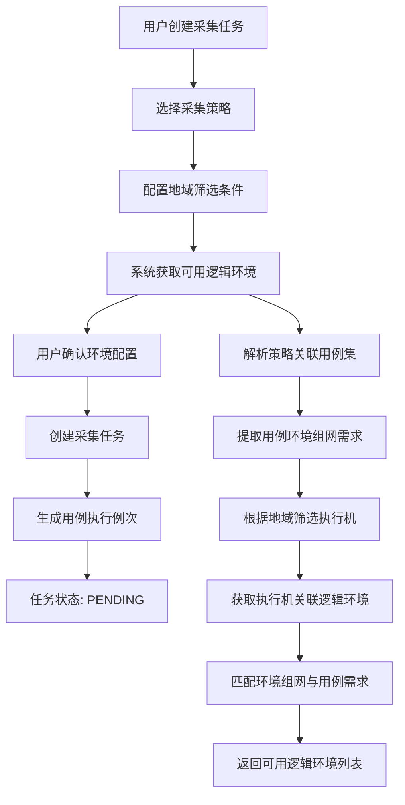

### 2. 用例执行流程

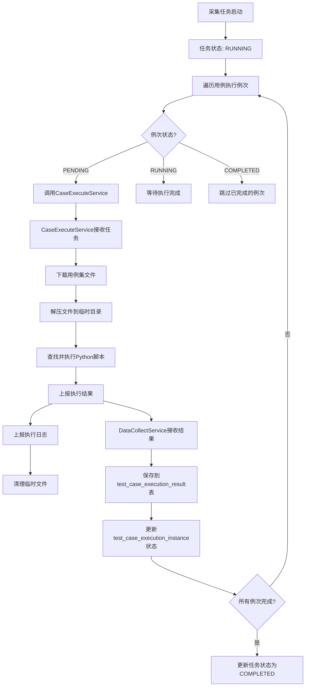

### 3. 环境匹配流程

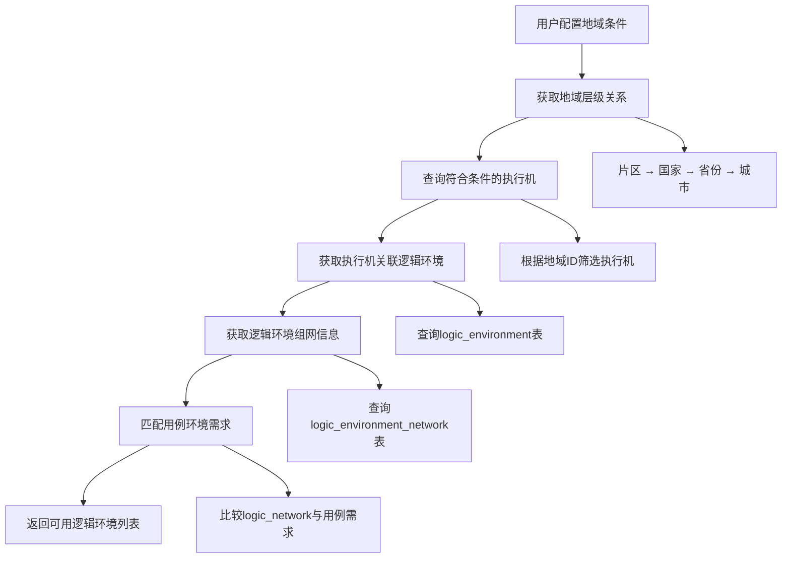

### 4. 数据流转关系

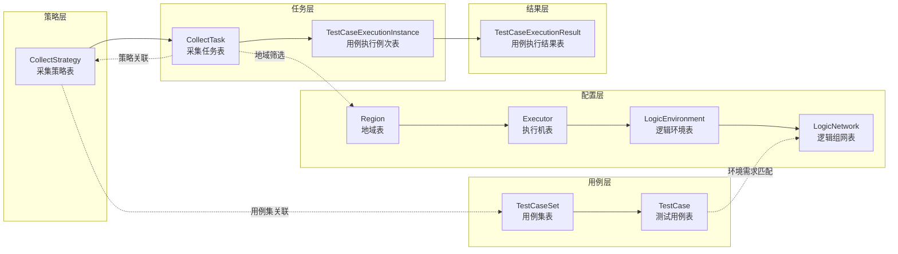

## 服务交互关系

### 1. 服务架构图

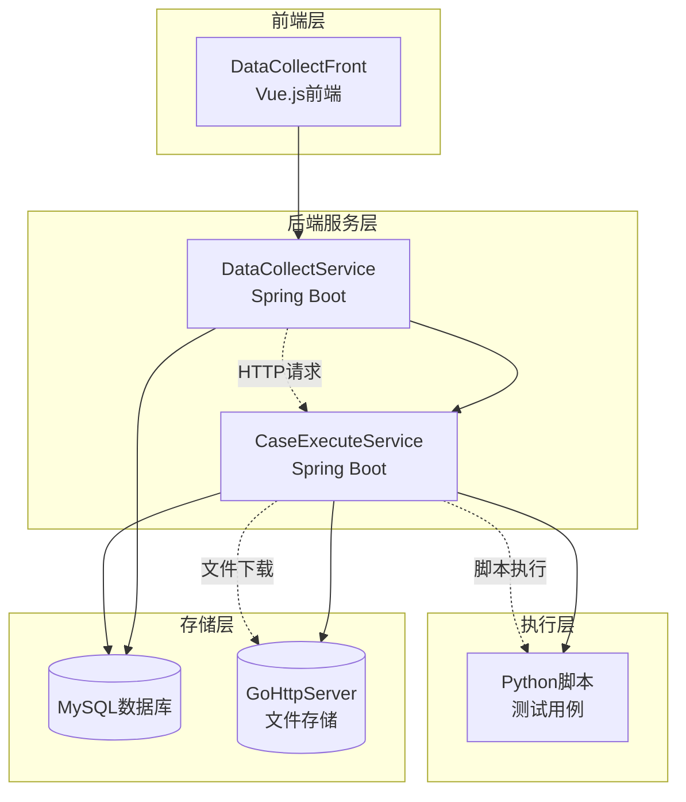

### 2. 接口调用关系

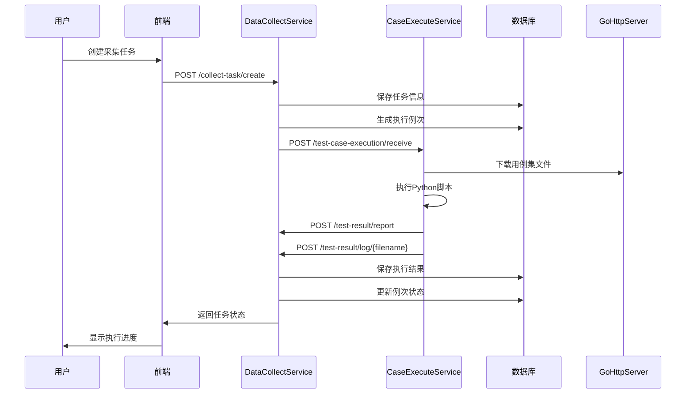

## 状态流转图

### 1. 任务状态流转

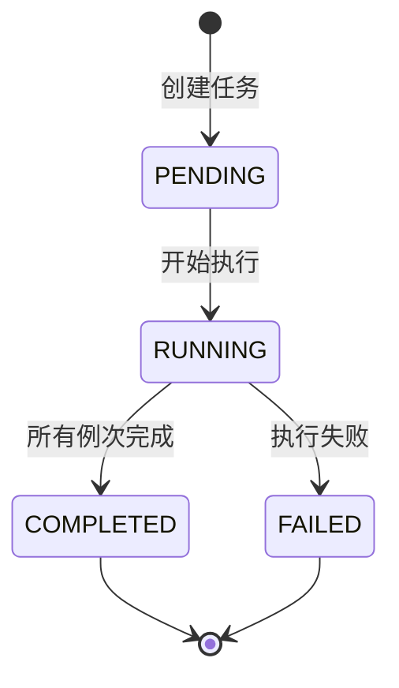

### 2. 用例执行例次状态流转

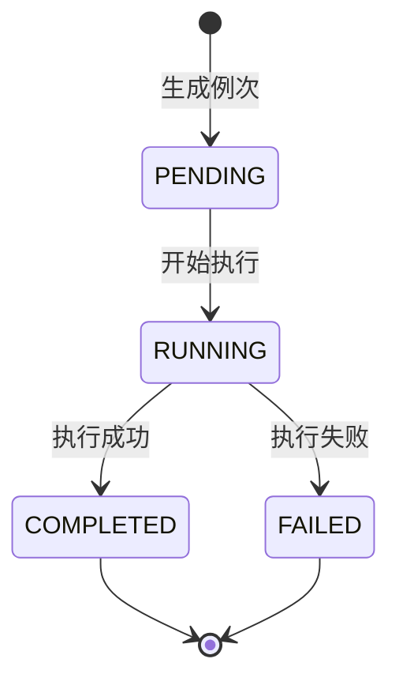

### 3. 执行机状态流转

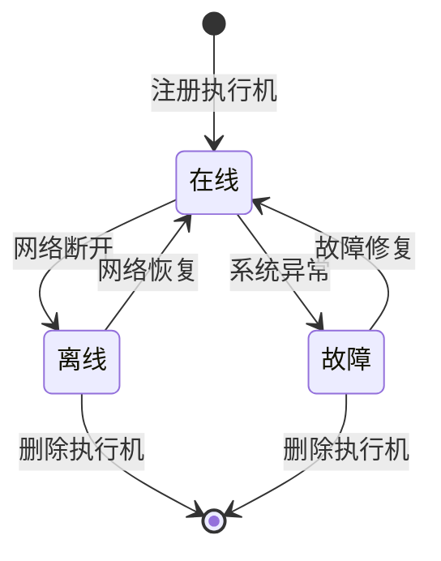

## 数据同步关系

### 1. 任务进度同步

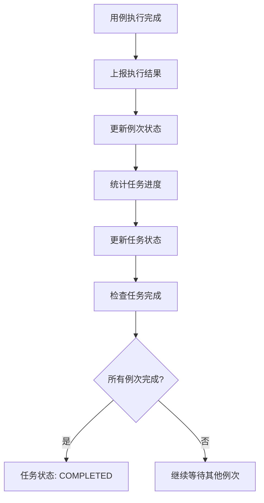

### 2. 环境资源同步

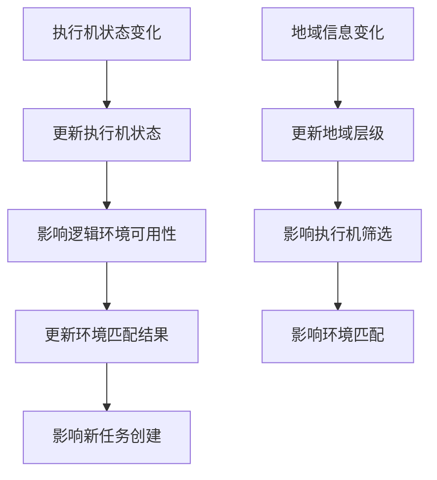

## 错误处理流程

### 1. 执行失败处理

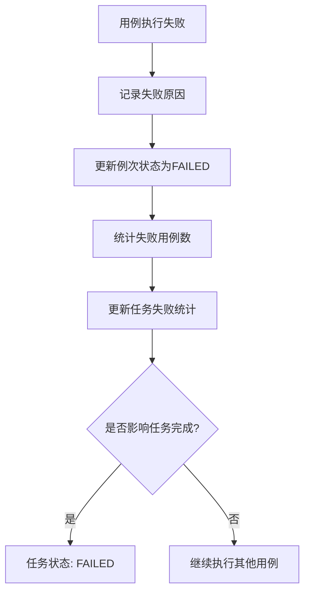

### 2. 网络异常处理

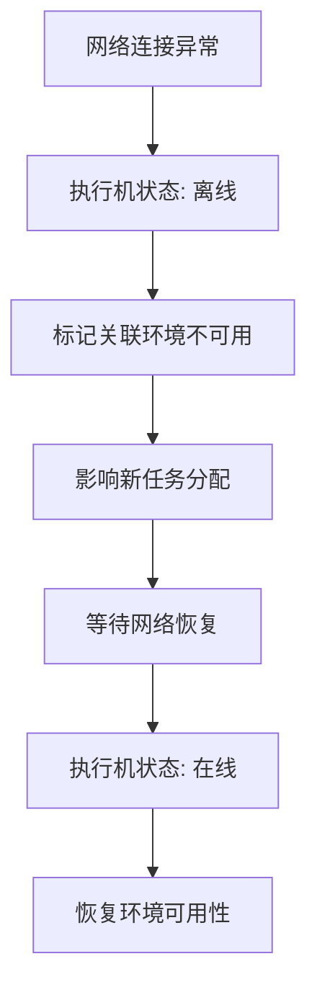

## 性能优化策略

### 1. 数据库优化

- **索引优化**: 为常用查询字段建立索引
- **分页查询**: 大数据量查询使用分页
- **缓存策略**: 热点数据使用Redis缓存

### 2. 并发处理

- **异步执行**: 用例执行采用异步方式
- **线程池**: 使用线程池管理并发任务
- **队列机制**: 任务排队执行，避免资源竞争

### 3. 资源管理

- **连接池**: 数据库连接池管理
- **文件清理**: 及时清理临时文件
- **内存管理**: 合理控制内存使用
