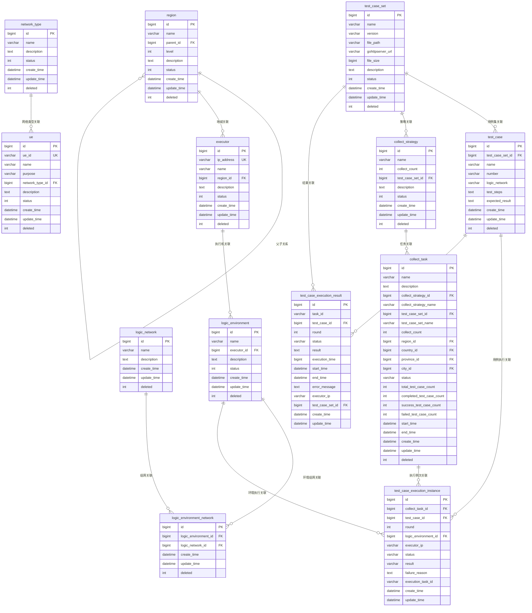

# 数据库实体关系图

## 概述

本文档描述了DataCollectService系统的数据库实体及其关联关系，使用Mermaid图表进行可视化展示。

## 核心实体关系图



## 实体详细说明

### 1. 基础配置实体

#### Region (地域表)
- **用途**: 管理地域层级关系（片区→国家→省份→城市）
- **层级**: 1-片区，2-国家，3-省份，4-城市
- **自关联**: parent_id指向父级地域

#### NetworkType (网络类型表)
- **用途**: 定义网络类型（如4G、5G、WiFi等）
- **关联**: UE设备关联网络类型

### 2. 执行机相关实体

#### Executor (执行机表)
- **用途**: 管理测试执行机
- **状态**: 0-离线，1-在线，2-故障
- **关联**: 属于特定地域

#### UE (UE设备表)
- **用途**: 管理测试用的UE设备
- **关联**: 关联网络类型

### 3. 逻辑环境相关实体

#### LogicEnvironment (逻辑环境表)
- **用途**: 定义测试逻辑环境
- **关联**: 关联执行机

#### LogicNetwork (逻辑组网表)
- **用途**: 定义逻辑组网类型
- **关联**: 通过中间表关联逻辑环境

#### LogicEnvironmentNetwork (逻辑环境组网关联表)
- **用途**: 多对多关联表
- **关联**: 逻辑环境与逻辑组网的多对多关系

### 4. 用例集相关实体

#### TestCaseSet (用例集表)
- **用途**: 管理测试用例集
- **文件**: 支持本地文件和gohttpserver文件
- **关联**: 包含多个测试用例

#### TestCase (测试用例表)
- **用途**: 管理具体测试用例
- **逻辑组网**: 记录用例的环境组网需求
- **关联**: 属于特定用例集

### 5. 采集策略和任务实体

#### CollectStrategy (采集策略表)
- **用途**: 定义数据采集策略
- **采集次数**: 指定每个用例的执行轮次
- **关联**: 关联用例集

#### CollectTask (采集任务表)
- **用途**: 具体的采集任务实例
- **地域筛选**: 支持多级地域筛选
- **状态跟踪**: 记录任务执行状态和进度
- **关联**: 基于策略创建，关联地域

### 6. 用例执行相关实体

#### TestCaseExecutionInstance (用例执行例次表)
- **用途**: 记录每个用例的具体执行例次
- **状态**: PENDING/RUNNING/COMPLETED/FAILED
- **结果**: SUCCESS/FAILED/BLOCKED
- **关联**: 关联采集任务、用例、逻辑环境

#### TestCaseExecutionResult (用例执行结果表)
- **用途**: 存储CaseExecuteService上报的执行结果
- **详细信息**: 包含执行时间、错误信息等
- **关联**: 关联任务、用例、用例集

## 业务流程关系

### 1. 任务创建流程
```
CollectStrategy → CollectTask → TestCaseExecutionInstance
```

### 2. 用例执行流程
```
TestCaseExecutionInstance → CaseExecuteService → TestCaseExecutionResult
```

### 3. 环境匹配流程
```
Region → Executor → LogicEnvironment → LogicEnvironmentNetwork → LogicNetwork
```

### 4. 用例管理流程
```
TestCaseSet → TestCase → TestCaseExecutionInstance
```

## 关键索引设计

### 1. 主键索引
- 所有表都有自增主键id

### 2. 唯一索引
- `executor.ip_address`: 执行机IP唯一
- `ue.ue_id`: UE ID唯一
- `test_case_set.name_version`: 用例集名称版本唯一

### 3. 外键索引
- `executor.region_id`: 地域关联
- `test_case.test_case_set_id`: 用例集关联
- `collect_task.collect_strategy_id`: 策略关联
- `test_case_execution_instance.collect_task_id`: 任务关联

### 4. 查询索引
- `test_case_execution_instance.status`: 状态查询
- `test_case_execution_result.task_id`: 任务结果查询
- `collect_task.status`: 任务状态查询

## 数据完整性约束

### 1. 逻辑删除
- 所有业务表都支持逻辑删除（deleted字段）

### 2. 状态约束
- 执行状态：PENDING → RUNNING → COMPLETED/FAILED
- 任务状态：PENDING → RUNNING → COMPLETED/FAILED

### 3. 关联约束
- 地域层级关系通过parent_id维护
- 执行机必须属于有效地域
- 用例必须属于有效用例集

## 扩展性设计

### 1. 水平扩展
- 支持多执行机部署
- 支持多地域数据采集

### 2. 垂直扩展
- 支持新增网络类型
- 支持新增逻辑组网
- 支持新增用例集

### 3. 功能扩展
- 支持用例执行结果详细分析
- 支持任务执行历史查询
- 支持环境资源统计
